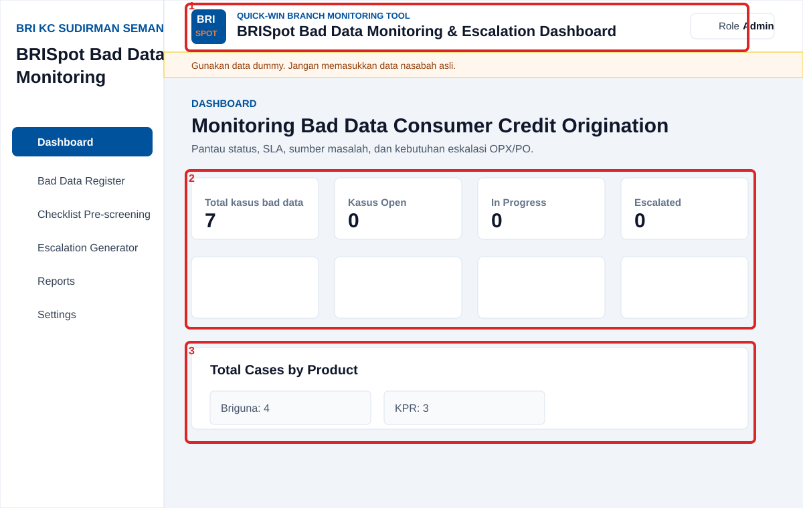
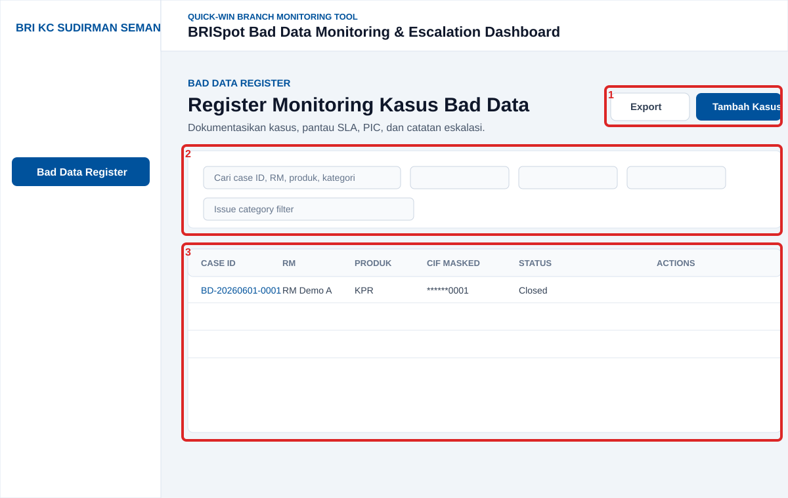
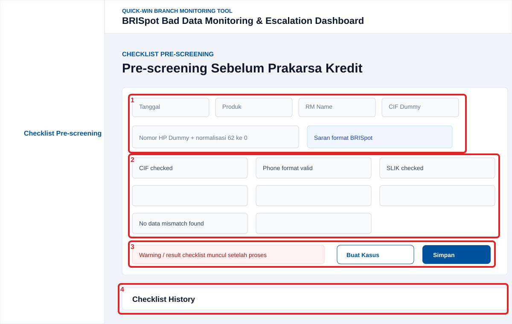
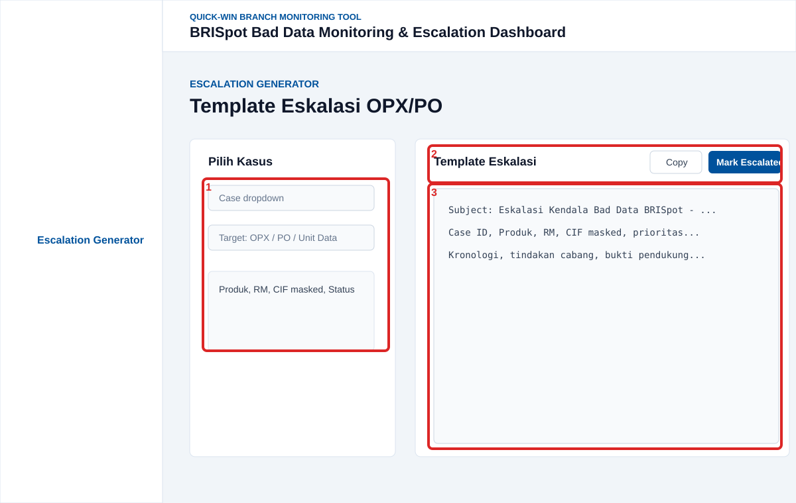
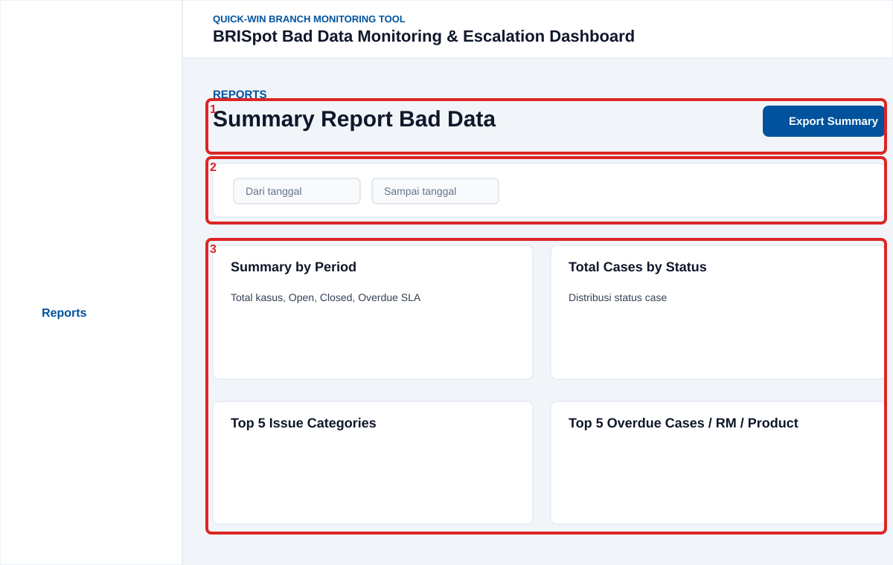
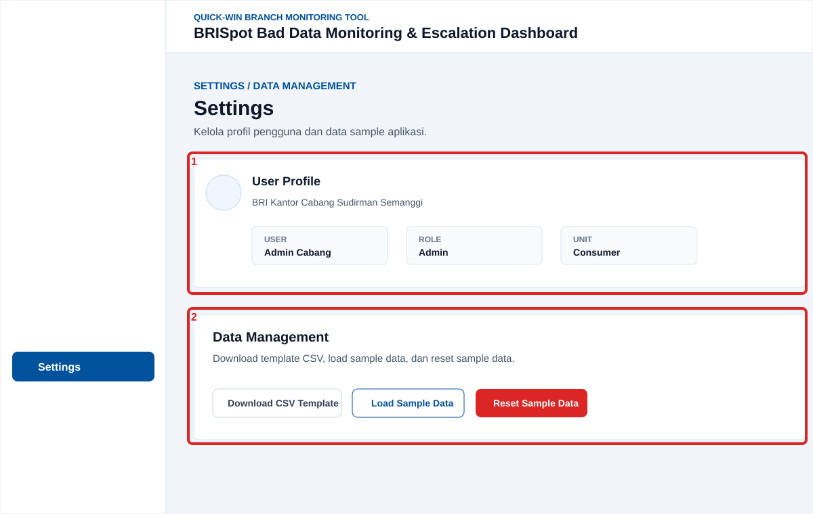

# User Guide

BRISpot Bad Data Monitoring & Escalation Dashboard digunakan untuk mencatat, memantau, dan menindaklanjuti kasus bad data pada proses Consumer credit origination KPR dan Briguna di level cabang.

Panduan ini menjelaskan cara menggunakan aplikasi per halaman. Kotak merah pada gambar menunjukkan area yang dijelaskan.

## Navigasi Umum

- Gunakan sidebar kiri untuk berpindah halaman.
- Gunakan role selector di kanan atas untuk simulasi akses:
  - Admin: akses penuh.
  - RM: input dan follow-up operasional.
  - Viewer: dashboard dan reports.
- Semua data pada MVP harus dummy. Jangan memasukkan CIF, nama nasabah, atau nomor HP asli.

## 1. Dashboard

Kotak merah:

1. Header aplikasi: menampilkan logo BRISpot Consumer, nama aplikasi, dan role aktif.
2. KPI cards: ringkasan jumlah kasus, status, SLA overdue, dan aging.
3. Product summary: ringkasan total kasus berdasarkan produk.

Cara menggunakan:

1. Buka menu **Dashboard**.
2. Lihat KPI utama untuk mengetahui kondisi kasus bad data saat ini.
3. Gunakan status cards untuk membaca beban kasus:
   - Total kasus bad data.
   - Open.
   - In Progress.
   - Escalated.
   - Waiting Feedback.
   - Closed.
   - Overdue SLA.
   - Average aging days.
4. Lihat ringkasan produk untuk membandingkan volume kasus KPR, Briguna, dan Others.
5. Scroll ke bawah untuk melihat chart:
   - Cases by issue category.
   - Cases by status.
   - Cases by product.
   - Cases by RM.
   - Cases by source system.
   - Trend bulanan.
   - Distribusi SLA overdue.

Output yang diharapkan:

- User dapat mengetahui prioritas follow-up harian.
- Branch leader dapat melihat isu dominan dan status SLA.

## 2. Bad Data Register

Kotak merah:

1. Tombol aksi: export data dan tambah kasus.
2. Area filter dan search.
3. Tabel register kasus dan action per row.

Cara menambah kasus:

1. Buka menu **Bad Data Register**.
2. Klik **Tambah Kasus**.
3. Isi data dummy:
   - RM Name.
   - Product.
   - CIF dummy.
   - Customer name dummy.
   - Phone number dummy.
   - Issue category.
   - Source system.
   - Process stage.
   - Priority.
   - Status.
   - Assigned PIC.
   - Target resolution date.
   - Action taken.
   - Evidence note.
4. Klik **Simpan Kasus**.

Cara mencari dan memfilter:

1. Gunakan search box untuk mencari berdasarkan case ID, RM, produk, kategori, status, atau source system.
2. Gunakan dropdown filter untuk status, product, priority, dan issue category.
3. Gunakan filter tanggal untuk membatasi periode created date.
4. Klik **Reset Filter** untuk menghapus filter.

Cara update kasus:

1. Klik icon edit pada row kasus.
2. Ubah status, PIC, action taken, atau field lain.
3. Klik **Simpan Kasus**.

Cara close kasus:

1. Klik icon close/check pada row kasus.
2. Sistem mengubah status menjadi **Closed** dan mengisi closed date.

Cara export:

1. Atur filter jika diperlukan.
2. Klik **Export Excel**.
3. File export berisi data filtered dengan CIF, nama, dan nomor HP termasking.

Catatan masking:

- CIF ditampilkan sebagai `******1234`.
- Phone ditampilkan sebagai `0812****7890`.
- Nama ditampilkan dalam format masking per kata.

## 3. Checklist Pre-screening

Kotak merah:

1. Input identitas checklist: tanggal, produk, RM, CIF dummy, nomor HP dummy, dan normalisasi nomor.
2. Checklist item yang harus dicek sebelum prakarsa.
3. Area hasil validasi dan tombol proses.
4. Tabel history checklist.

Cara menjalankan checklist:

1. Buka menu **Checklist Pre-screening**.
2. Isi:
   - Produk.
   - RM Name.
   - CIF dummy.
   - Phone number dummy.
3. Jika nomor HP dimulai dengan `62`, sistem memberi saran normalisasi ke prefix `0`.
   - Contoh: `6281234567890` menjadi `081234567890`.
4. Review checklist item.
5. Jika ada item kritikal yang gagal, uncheck item tersebut.

Hasil checklist:

- Warning merah muncul jika data belum layak untuk dilanjutkan.
- Notifikasi hijau “Checklist lolos” hanya muncul setelah user melakukan proses/interaksi pada checklist.
- Notifikasi tidak muncul otomatis saat halaman baru dibuka.

Cara membuat kasus dari checklist:

1. Uncheck salah satu item kritikal.
2. Klik **Buat Kasus dari Checklist**.
3. Sistem membuat bad data case otomatis dari failed checklist items.
4. Sistem menyimpan checklist run ke history.

Cara menyimpan checklist tanpa membuat kasus:

1. Lengkapi form.
2. Klik **Simpan Checklist**.
3. Data masuk ke checklist history.

Cara export history:

1. Klik **Export Excel** pada bagian checklist history.
2. Export berisi hasil checklist dengan CIF dan phone termasking.

## 4. Escalation Generator

Kotak merah:

1. Panel pemilihan case dan target eskalasi.
2. Tombol copy dan mark escalated.
3. Text area template eskalasi.

Cara generate template:

1. Buka menu **Escalation Generator**.
2. Pilih case ID dari dropdown.
3. Pilih escalation target:
   - OPX.
   - PO.
   - Unit Data.
   - Other.
4. Template eskalasi otomatis terbentuk.

Cara copy template:

1. Klik **Copy**.
2. Paste template ke media koordinasi yang digunakan cabang.

Cara mark escalated:

1. Klik **Mark Escalated**.
2. Sistem mengubah status case menjadi **Escalated**.
3. Sistem mengisi escalation date dan escalation target.

Isi template:

- Subject eskalasi.
- Case ID.
- Produk.
- RM.
- CIF masked.
- Tahap proses.
- Kategori kendala.
- Sumber data/system.
- Prioritas.
- Dampak bisnis.
- Tanggal temuan.
- Target penyelesaian.
- Kronologi.
- Tindakan cabang.
- Bukti pendukung.

## 5. Reports

Kotak merah:

1. Header dan tombol export summary.
2. Filter periode.
3. Summary tables dan analytical breakdown.

Cara melihat report:

1. Buka menu **Reports**.
2. Gunakan filter **Dari** dan **Sampai** untuk memilih periode.
3. Review ringkasan:
   - Summary by period.
   - Total cases by status.
   - Top 5 issue categories.
   - Cases by product.
   - Top 5 overdue cases.
   - Cases by RM.

Cara export summary:

1. Atur periode jika diperlukan.
2. Klik **Export Summary**.
3. Sistem membuat workbook Excel dengan beberapa sheet ringkasan.

Kegunaan report:

- Bahan update mentor.
- Bahan koordinasi RM dan branch leader.
- Bahan eskalasi/monitoring OPX/PO.

## 6. Settings

Kotak merah:

1. User Profile.
2. Data Management.

User Profile:

- Menampilkan user simulasi, role aktif, unit, dan cabang.
- Tidak ada pilihan role di konten Settings.
- Role selector tetap tersedia di header global aplikasi.

Data Management:

1. **Download CSV Template**
   - Mengunduh template CSV untuk standardisasi input.
2. **Load Sample Data**
   - Memuat sample cases dummy ke Supabase.
3. **Reset Sample Data**
   - Menghapus data dummy dan memuat ulang sample data.
   - Gunakan hanya saat perlu reset demo.

Catatan operasional:

- Reset sample data hanya untuk Admin.
- Jangan gunakan data nasabah asli.

## Troubleshooting Pengguna

### Data tidak muncul

1. Pastikan environment Supabase sudah benar.
2. Buka Settings.
3. Klik **Load Sample Data**.
4. Refresh Dashboard.

### Export Excel tidak berjalan

1. Pastikan browser mengizinkan download.
2. Coba ulang dari Register, Checklist History, atau Reports.

### Tombol tambah/edit tidak tersedia

1. Cek role di header.
2. Gunakan Admin atau RM untuk input/update data.
3. Viewer hanya untuk monitoring.

### Checklist tidak bisa membuat kasus

1. Pastikan ada item kritikal yang gagal.
2. Jika semua item lolos, tombol **Buat Kasus dari Checklist** akan disabled.

